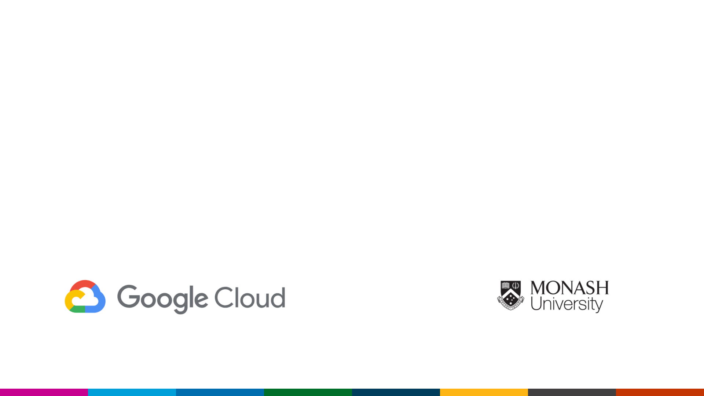

Theme: Template
autoscale: true
text: Roboto, #006cab
text-strong: Roboto Bold, #006dae
text-emphasis: Roboto Light Italic
header: Google Sans, #006CAB
header-strong: Google Sans,#005DAE
header-emphasis: Google Sans, #53585F  
code: Fira Code Medium, #EE783F, #8B3D90, #2E59A2, #DF393F, #1EA8D9
background-color: #FFFFFF  
footer: Copyright Ⓒ Eric Jiang 2018 | Based off _[Building and Maintaining Applications on Google Cloud Platform](https://speakerdeck.com/lorderikir/building-and-maintaining-scalable-applications-on-google-cloud-platform)_ Tech Talk
slidenumbers: false


## Building NodeJS Apps on Google's Scalable Infrastructure for JuniorDev 
#### _[https://github.com/lorderikir/juniordev-gcp-techtalk](https://github.com/lorderikir/juniordev-gcp-techtalk)_ <br/><br/>  Eric Jiang <br/>[@lorderikir](https://twitter.com/lorderikir)

#### Junior Software Engineer (Backend/Infrastructure), Monash University




[.autoscale: false]
---

# Hi, I'm **Eric Jiang** 👋 <br/><br/>

- I founded and currently am currently the Backend & Infrastructure Engineer at MonPlan ([monplan.apps.monash.edu](https://monplan.apps.monash.edu)) (_Monash Course Planning Tool_) at eSolutions, [Monash University](https://monash.edu)
   - eSolutions is the central IT body of Monash University.
- Part of the _Student Innovation Team_
- I also co-founded and maintaining GeckoDM and MARIE.js
- Also have worked at Localz too!


---


[.autoscale: false]
---
## Student Innovation Program at Monash University

_Unfortunately this program is applicable to Current Monash Students only_

- If you have an idea don't leave it in the dark, we would ❤️ to see it.
    - [Test.Drive](https://monash.edu/test-drive)
    - Email me: [Eric.Jiang@monash.edu](mailto:Eric.Jiang@monash.edu) or hit me up on the Junior Dev Slack (@lorderikir) and I'll redirect you to right person
- We also hire Students for casual project-based positions too! 🎉


---
## Talk Summary

1.  Introduction to Google Cloud
2.  What is Google App Engine
    a. GAE Environments
    b. What is Scaling and Why is it Important?
3.  Deep-Dive
    a. Deploying a simple API to Google App Engine
    b. Automating Deployments and Testing
4.  Other Cool GCP Products


---
## What is Google Cloud Platform?

> Google Cloud Platform lets you build and host applications and websites, store data, and analyze data on Google's scalable infrastructure.

Composes of many applications, such as:

- Google App Engine (GAE)
- Google Kubernetes Engine (GKE) <span style="font-size: 15px">Previously known as Google Container Engine</span>
- Google DataStore
- Cloud ML (built off _TensorFlow_)
- and much more

> Did you know that Firebase and DialogFlow (API.AI) are both built on Google Cloud Platform


---

## GCP Products


---


---
## Google App Engine

| Language                         | Environment        |
|----------------------------------|--------------------|
| Java 7  (and Kotlin<sup>1</sup>) | Standard           |
| Java 8                           | Standard /Flexible |
| Node.js 8                        | Standard (Beta)    |
| Node.js (>4)                     | Flexible           |
| Python 2.7                       | Standard           |
| Python 3.5                       | Flexible           |


[.autoscale: true]
---

## So what is the difference between the Environments?

**Standard Environments** run in a specialised envrionment. Though building the application is more constrained then other environments, it means that scaling up is faster.

**Flexible Environment** applications run off a Docker container, it is designed for applications that recieve constant traffic. 

When deployed they are Google Compute Engine as Virtual Machines Because they run off Docker, you can write your own Dockerfile Configuration to deploy, and deploy it anywhere, you can even move it to AWS.

Note: all of these runs as containers...


---


---


---

## The Standard Environment has Instance Classes
> Each application running in the standard environment has an instance class, which determines its compute resources and pricing.

| Instance Class | Memory Limit | CPU Limit | $/hr (Sydney) |
|----------------|--------------|-----------|---------------|
| F1 (default)   | 128 MB       | 600 MHz   | $0.068        |
| F2             | 256 MB       | 1.2 GHz   | $0.135        |
| F4             | 512 MB       | 2.4 GHz   | $0.270        |
| F4_1G          | 1024 MB      | 2.4GHz    | $0.405        |


---

### So Back then running NodeJS Application was Impossible on App Engine Standard


This is because Google's infrastructure code is written in low-level language (so many C libraries are not allowed)


---

### Along came gVisor (which also pissed a lot of Docker Devs off)

> gVisor is more lightweight than a VM while maintaining a similar level of isolation. The core of gVisor is a kernel that runs as a normal, unprivileged process that supports most Linux system calls.


---

## Scaling Modern Web Applications
### Me when I look at Scaling:


---

### Scaling Vertically vs Scaling Horizontally 


**Horizontal Scaling**: scale by adding more machines into your pool of resources machine.


**Vertical Scaling**: scale by adding more power (CPU, RAM) to an existing machine.


---


## Benefits of Horizontal Scaling
- Dynamic scaling allows spinning up more instances and nodes faster, i.e. if you suddenly get a influx of traffic
- Vertical Scaling is limited to capacity of resources, simply adding more resources

- Just simplying load testing isn't good enough, examples of this include Niantic (PokemonGo) and Australian Census 2016


---
### Disclaimer: NodeJS on GAE is still in beta. USE AT YOUR OWN RISK


---

# Time for a demo 🤞


---

# Let's Deploy a simple expressJS Application


---
index.js:

```
const express = require('express');
const app = express();
const APP_PORT = process.env.port || 8080;

const exampleRouter = (req, res) => {
  res.send('hello world!');
}
app.get('/', (req, res) => res.send('Hello from Google App Engine!'));
app.use('/test', exampleRouter);
app.get('/teapot', (req, res) => {
  res.status(418).send("Hello I'm a teapot running on Node Standard GAE");
});

app.listen(APP_PORT, () =>
  console.log(`Example app listening on port ${APP_PORT}!`)
);

```


---

### We need an `app.yaml` to help define the runtime settings on GAE


app.yaml:

```
runtime: nodejs8
```


---

## In some languages we define this in `appengine-web.xml`

```
<?xml version="1.0" encoding="utf-8"?>
<appengine-web-app xmlns="http://appengine.google.com/ns/1.0">
    <runtime>java8</runtime>
    <application>monplan-au-dev</application><!-- unused for Cloud SDK based tooling -->
    <version>1</version><!-- unused for Cloud SDK based tooling -->
    <threadsafe>true</threadsafe>
    <sessions-enabled>true</sessions-enabled>
    <url-stream-handler>urlfetch</url-stream-handler>
    <system-properties>
        <property name="java.util.logging.config.file" value="WEB-INF/classes/logging.properties"/>
        <property name="spring.profiles.active" value="dev"/>
    </system-properties>
    <automatic-scaling>
        <min-instances>1</min-instances>
        <max-instances>100</max-instances>
    </automatic-scaling>
</appengine-web-app>
```


---

# Now we need to run `gcloud app deploy`


---
## Once we successfully deployed

We can access the site via [https://juniordev-gcp-demo.appspot.com/](https://juniordev-gcp-demo.appspot.com/)


---

### So what happens under the hood?


---

## What happens when the Cloud SDK deploys to GAE

1. Builds the Files (For the Java Envrionment this builds it into a WAR package)
2. Bundles the Files and Pushes it Up to Google Cloud Storage
3. Reconfigures Google App Engine to deploy
  i. Change scaling configuration
  ii. reallocate traffic to new version


---

## Automating Deployments
- Like alot of environments deploy apps to GAE is really straightforward and easy
- All you need is the Google Cloud SDK and the simple command `gcloud app deploy`
- However, you will need Service Accounts (I like to call them bot accounts) to automated this.
- You can find out more [https://s.lorderikir.me/2PxBtRJ](https://s.lorderikir.me/2PxBtRJ)


---

# Other Awesome Products on GCP

- Cloud ML (Google Cloud Machine Learning) which is built off TensorFlow 
- Compute Engine - Google VMs
- BigQuery - Big Data (really awesome for Big Data analysis, companies like REA, Papercut uses this for Big Data analysis) - Our team uses it to provide Faculties and Business Units with reporting functionality.
- Kubernetes Engine - Containorisation! what else do you want?
- Cloud Storage - CDN provider of files (like _Amazon S3_)
- Network Balancer - for Load Balancing of traffic for your applications
- Cloud ML APIs such as Natural Language Processing, Data Loss Prevention, etc.


---


---
### So what happens if something goes wrong?


---

### In comes, StackDriver Logging


---
## So what is Stackdriver Logging?         

> Stackdriver Logging allows you to store, search, analyze, monitor, and alert on log data and events from Google Cloud Platform and Amazon Web Services (AWS)

Stackdriver Logging is baked into Google App Engine applications


---
## Questions? 🤔 🎤 📣 
## and the chance to get some free stickers?


---

## Special thanks to:
- [Ben Theunissen](https://twitter.com/benjtheunissen), [REA Group](https://www.rea-group.com/)
- [Hugo Muller-Downing](https://twitter.com/hugojmd), [Localz](https://localz.com/)


---
# Goodbye 👋 and thanks for listening 🙏<br/><br/>

## Eric Jiang 
### [Twitter: @lorderikir](https://twitter.com/lorderikir)<br/>[GitHub: lorderikir](https://github.com/lorderikir)

_If you want to talk more about what I do or what is the Student Innovation Team hit me up!_

